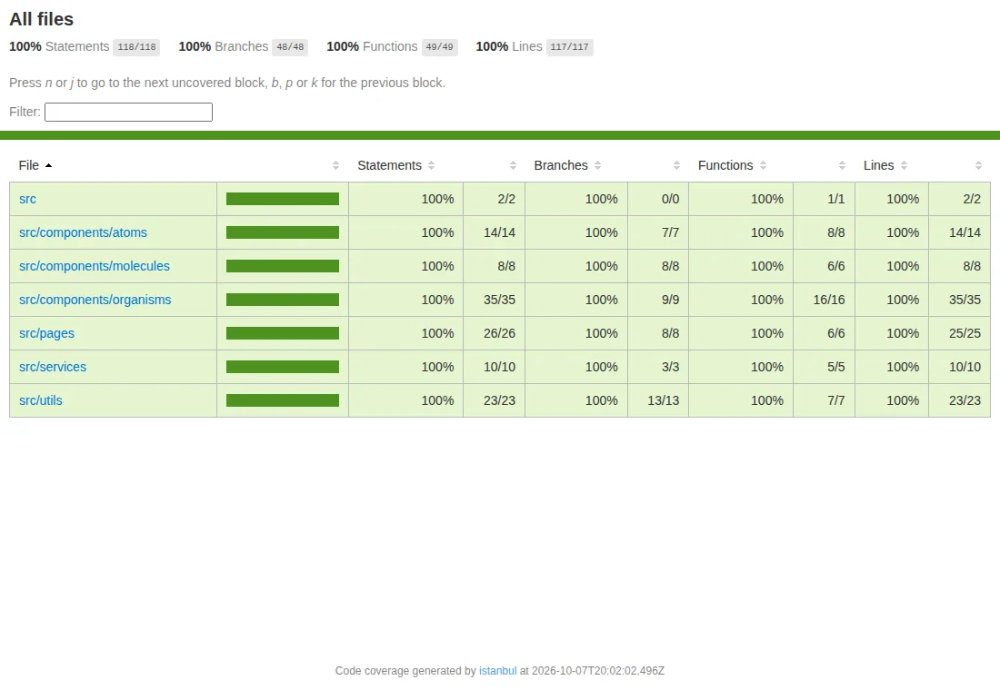
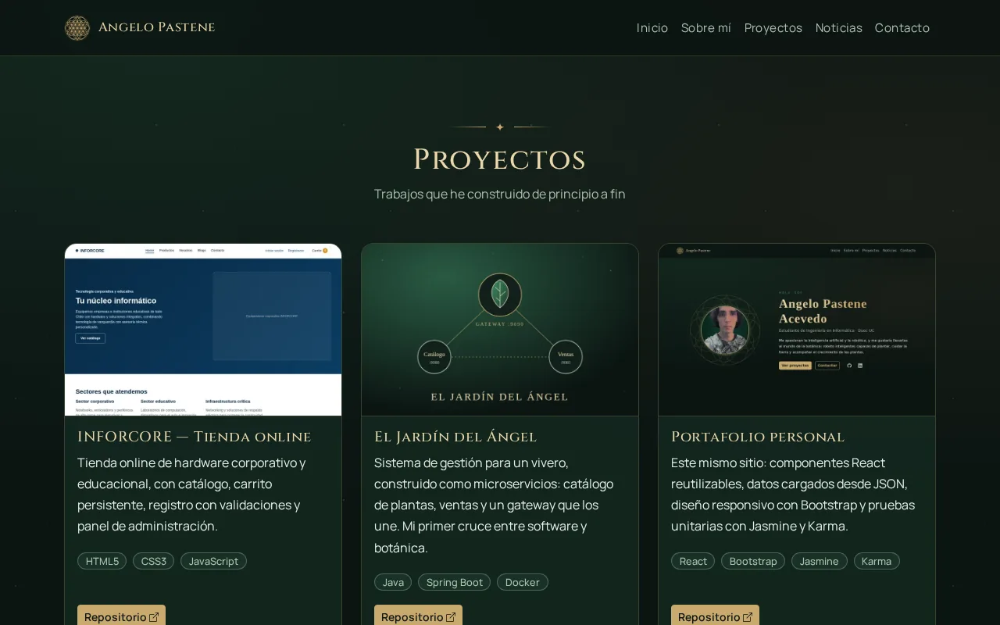
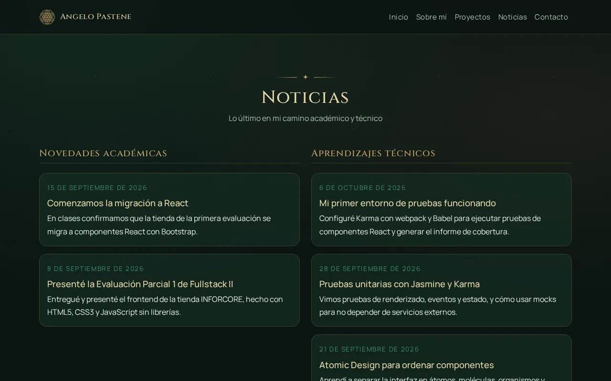

# Portafolio personal — Angelo Pastene Acevedo

Portafolio desarrollado en **React + Bootstrap** para la **Evaluación Formativa 2** de **DSY1104 Desarrollo Fullstack II** (Duoc UC, sede Maipú). Integra componentes propios y de Bootstrap, carga su contenido desde archivos JSON y tiene pruebas unitarias con **Jasmine y Karma**.

🌐 **Sitio publicado:** https://angelo-93.github.io/portafolio-angelo-pastene/


## Contenido

- [Características](#características)
- [Tecnologías](#tecnologías)
- [Requisitos](#requisitos)
- [Instalación y ejecución](#instalación-y-ejecución)
- [Pruebas](#pruebas)
- [Publicación en GitHub Pages](#publicación-en-github-pages)
- [Estructura del proyecto](#estructura-del-proyecto)
- [Ejemplos de uso](#ejemplos-de-uso)
- [Decisiones de diseño](#decisiones-de-diseño)
- [Créditos](#créditos)

## Características

- **Secciones:** Introducción, Sobre mí, Proyectos, dos secciones de Noticias (académicas y técnicas) y Contacto.
- **Datos en JSON:** perfil, proyectos y noticias se cargan desde `public/data/` con `fetch` y se guardan en el estado de React.
- **Componentes reutilizables** organizados con **Atomic Design** (átomos, moléculas, organismos y páginas), con props documentadas en JSDoc.
- **Diseño responsivo** con la grilla de Bootstrap: 1 columna en móvil, 2 en tablet y 3 en escritorio.
- **Accesible:** enlace "Saltar al contenido", textos alternativos, foco visible con teclado, contraste suficiente y respeto por la preferencia de movimiento reducido. La auditoría automática con axe-core no encontró problemas en las normas WCAG 2 A/AA.
- **69 pruebas unitarias** con 100% de cobertura, ejecutables en Chrome, Firefox y Edge.

## Tecnologías

| Área | Herramienta |
|---|---|
| Interfaz | React 19, React-Bootstrap 2.10, Bootstrap 5.3 |
| Compilación y servidor de desarrollo | Vite 8 |
| Pruebas | Jasmine 4.6, Karma 6.4, React Testing Library 16 |
| Cobertura | istanbul (`babel-plugin-istanbul` + `karma-coverage`) |
| Traducción de JSX para las pruebas | webpack 5 + Babel |
| Publicación | GitHub Pages (`gh-pages`) |

## Requisitos

- **Node.js 20.19 o superior** (probado con Node 26.8.2 y npm 11). Para revisar tu versión: `node -v`.
- **Google Chrome**, para `npm test`. Para `npm run test:navegadores` también se necesitan **Firefox** y **Microsoft Edge**.

## Instalación y ejecución

```bash
# 1. Clonar el repositorio
git clone https://github.com/Angelo-93/portafolio-angelo-pastene.git
cd portafolio-angelo-pastene

# 2. Instalar dependencias
npm install

# 3. Levantar el servidor de desarrollo → http://localhost:5173
npm run dev
```

| Comando | Qué hace |
|---|---|
| `npm run dev` | Servidor de desarrollo con recarga automática |
| `npm run build` | Compila y minimiza el sitio en `dist/` |
| `npm run preview` | Sirve la versión compilada para revisarla |
| `npm run lint` | Revisa el código con oxlint |
| `npm test` | Ejecuta las pruebas y genera el informe de cobertura |
| `npm run test:navegadores` | Ejecuta las pruebas en Chrome, Firefox y Edge |
| `npm run test:watch` | Ejecuta las pruebas en Chrome cada vez que guardas un cambio |
| `npm run deploy` | Compila y publica en GitHub Pages |

> `npm install` muestra avisos de vulnerabilidades en dependencias internas de Karma y `gh-pages`. Solo afectan a las herramientas de desarrollo, no al sitio publicado (`npm audit --omit=dev` da 0). No ejecutes `npm audit fix --force`, porque rompe Karma.

## Pruebas

```bash
npm test
```

Karma abre Chrome sin ventana (headless), ejecuta las 69 pruebas escritas con Jasmine y genera el informe de cobertura en `coverage/index.html`.

| Métrica | Resultado | Umbral mínimo |
|---|---|---|
| Statements | 100% (118/118) | 60% |
| Branches | 100% (48/48) | 60% |
| Functions | 100% (49/49) | 60% |
| Lines | 100% (117/117) | 60% |

Las pruebas cubren renderizado, props, renderizado condicional, estado, eventos, mocks (`spyOn` sobre `fetch`, `jasmine.createSpy`), casos de borde y el contrato de los JSON.

📋 **Plan de pruebas** con los 69 casos y su resultado esperado: [docs/PLAN_DE_PRUEBAS.md](docs/PLAN_DE_PRUEBAS.md)
📊 **Informe de cobertura** detallado: [docs/INFORME_COBERTURA.md](docs/INFORME_COBERTURA.md)



## Publicación en GitHub Pages

```bash
npm run deploy
```

El script compila el sitio (`predeploy` → `npm run build`) y sube la carpeta `dist/` a la rama `gh-pages`. En el repositorio, **Settings → Pages** debe tener como fuente la rama `gh-pages` (carpeta `/ (root)`).

`vite.config.js` usa `base: './'` (rutas relativas), así el sitio funciona dentro de la subruta `/portafolio-angelo-pastene/` de GitHub Pages.

## Estructura del proyecto

```
portafolio-angelo-pastene/
├── public/
│   ├── data/                  # Fuente de datos JSON (perfil, proyectos, noticias)
│   └── img/                   # Foto e imágenes de proyectos (WebP optimizadas)
├── src/
│   ├── components/
│   │   ├── atoms/             # Piezas mínimas: Icono, GeometriaSagrada, EnlaceSaltarContenido
│   │   ├── molecules/         # TituloSeccion, EnlacesRedes, TarjetaProyecto, TarjetaNoticia
│   │   └── organisms/         # BarraNavegacion, Portada, SobreMi, Proyectos,
│   │                          # SeccionNoticias, FormularioContacto, PiePagina
│   ├── pages/
│   │   └── PaginaPortafolio.jsx   # Carga los datos y los reparte por props
│   ├── services/
│   │   └── datosService.js    # Único punto que lee los JSON (fetch + manejo de errores)
│   ├── utils/                 # Validaciones, formato de fechas, cálculos geométricos
│   ├── styles/estilos.css     # Identidad visual sobre las variables de Bootstrap
│   ├── App.jsx                # Ensambla menú, accesibilidad y página
│   └── main.jsx               # Punto de entrada
├── docs/                      # Plan de pruebas, informe de cobertura y capturas
├── karma.conf.cjs             # Configuración de Karma + Jasmine + cobertura
└── vite.config.js
```

Cada componente tiene su archivo de pruebas al lado, con el mismo nombre y la terminación `.spec.jsx`.

## Ejemplos de uso

**Navegación en móvil:** el menú se pliega en un botón y se despliega al tocarlo.


**Proyectos:** cada tarjeta muestra la imagen, la descripción, las tecnologías y el enlace al repositorio.



**Noticias:** un mismo componente se usa dos veces, filtrando por categoría.



**Validación del formulario:** al enviar con datos incompletos, cada campo muestra su error. Al corregirlo, el error desaparece.


**Editar el contenido:** para agregar un proyecto o una noticia no hace falta tocar componentes. Basta con añadir un objeto en `public/data/proyectos.json` o en `public/data/noticias.json`, y las pruebas de contrato avisan si falta algún campo:

```json
{
  "id": 6,
  "categoria": "tecnica",
  "titulo": "Nueva noticia",
  "fecha": "2026-10-20",
  "contenido": "Texto breve de la noticia."
}
```

## Decisiones de diseño

- **Identidad visual "jardín cósmico":** une botánica, tecnología y lo celestial. Usa una noche verde profunda, acentos dorados y geometría sagrada (Flor de la Vida) en líneas finas. Tipografías: Cinzel para los títulos y Manrope para el texto.
- **Bootstrap como base:** los estilos propios no reemplazan a Bootstrap. Cambian sus variables CSS (`--bs-*`) y crean las variantes de botón `btn-oro` y `btn-outline-oro`, con el modo oscuro oficial (`data-bs-theme="dark"`).
- **Optimización:** imágenes en WebP (la foto pasó de 1 MB a 35 KB), carga diferida (`loading="lazy"`), dimensiones declaradas para evitar saltos al cargar, íconos SVG incrustados (solo 3, en vez de una librería completa) y build minificado con Vite.
- **Un solo punto de acceso a datos:** si en el futuro los datos vienen de una API, solo cambia `datosService.js`.

## Créditos

- Íconos: [Bootstrap Icons](https://icons.getbootstrap.com/) (licencia MIT).
- Tipografías: [Cinzel](https://fonts.google.com/specimen/Cinzel) y [Manrope](https://fonts.google.com/specimen/Manrope) (SIL Open Font License), servidas por Google Fonts.

---

**Autor:** Angelo Pastene Acevedo · Ingeniería en Informática, Duoc UC · [GitHub](https://github.com/Angelo-93) · [LinkedIn](https://www.linkedin.com/in/angelo-pastene-acevedo-apa93lk)
